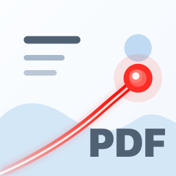

# PDF Laser

PDF Laser is a universal SwiftUI app for presenting PDF slide decks and image files with a temporary laser pointer and simple in-session pen markup.

<p align="center">
  
</p>

## Install With Homebrew

Install the signed, notarized macOS app from the PDF Laser Homebrew tap:

```sh
brew tap chkwon/tap
brew install pdflaser
```

Or as a one-liner without tapping first:

```sh
brew install --cask chkwon/tap/pdflaser
```

To upgrade later:

```sh
brew update
brew upgrade pdflaser
```

## What It Does

- Opens a user-selected PDF or common image file.
- Presents exactly one fitted page at a time.
- Supports macOS keyboard navigation: right, down, and space for next; left, up, and backspace for previous.
- Supports iPadOS touch navigation, on-screen previous/next controls, and best-effort external keyboard arrows.
- Provides five tools: None, Dot Laser, Trail Laser, Pen, and Erase.
- Keeps laser effects temporary.
- Keeps pen markup in memory per page for the current app session, with stroke-based erase.
- Supports clearing or undoing markup on the current page.
- Exports a new flattened marked copy: PDF sources save as PDF, and image sources save in the original image format.

## Privacy And Storage

PDF Laser does not use iCloud, cloud sync, a document browser, autosave, or app-managed document storage. It reads the PDF or image selected by the user and never modifies that original file. Laser effects remain temporary. Pen markup is session-only unless the user explicitly exports a new flattened marked copy.

## Architecture

- SwiftUI owns the application shell and toolbar.
- PDFKit loads PDF data and draws the current page; image files are converted into a single-page internal PDF for presentation.
- AppKit and UIKit wrappers provide page rendering and input capture.
- Shared model code stores navigation state, tool selection, laser settings, and pen strokes.
- All laser and pen points use normalized page-relative coordinates in the `0...1` range, so overlays stay aligned when the window or screen size changes.

## External Display

The iPadOS target includes an `ExternalDisplayManager` stub. The intended follow-up architecture is to attach a presentation-only window to the external `UIScreen`, render the same `PDFSlideView` without the toolbar there, and keep controls on the iPad display. The MVP keeps the iPad app fully usable without an external display.

## Build

This repo uses XcodeGen:

```sh
xcodegen generate
open PDFLaser.xcodeproj
```

Build the `PDFLaser-macOS` or `PDFLaser-iPadOS` scheme from Xcode.

## macOS Binary Release

The `macos-release` GitHub Actions workflow builds the macOS app, signs it with a Developer ID Application certificate, notarizes it with Apple, staples the notarization ticket, uploads a workflow artifact, and publishes a GitHub Release asset named like `PDF-Laser-v0.1-macOS-universal.zip`.

The workflow then updates `Casks/pdflaser.rb` in `chkwon/homebrew-tap` to point at the new release. Homebrew downloads the app directly from this repository's public GitHub releases.

Required GitHub repository secrets:

- `DEVELOPER_ID_APPLICATION_CERTIFICATE_BASE64`: base64-encoded Developer ID Application `.p12`.
- `DEVELOPER_ID_APPLICATION_CERTIFICATE_PASSWORD`: password for the exported `.p12`.
- `KEYCHAIN_PASSWORD`: temporary CI keychain password.
- `ASC_KEY_ID`: App Store Connect API key ID.
- `ASC_ISSUER_ID`: App Store Connect issuer ID.
- `ASC_PRIVATE_KEY`: contents of the App Store Connect `AuthKey_*.p8` private key.
- `HOMEBREW_TAP_TOKEN`: GitHub token with write access to `chkwon/homebrew-tap`, used to update `Casks/pdflaser.rb` after each release.

To create the certificate secret from an exported `.p12` on macOS:

```sh
base64 -i DeveloperIDApplication.p12 | pbcopy
```

Run the workflow manually with version `v0.1`, or push a `v0.1` tag. The workflow overrides the app marketing version from the tag/input, so `v0.1` produces app version `0.1`. The app remains outside the Mac App Store and does not add cloud storage or automatic document saving.

## License

PDF Laser is available under the [MIT License](LICENSE).
